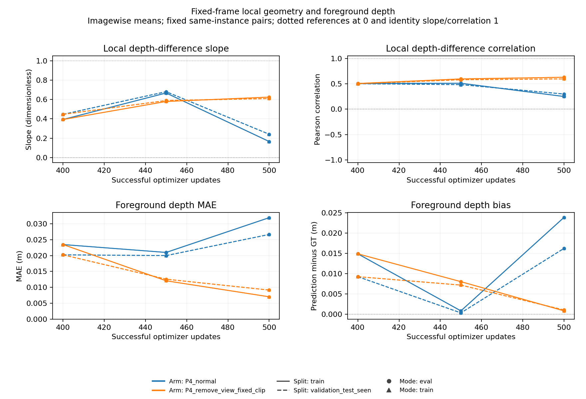

# CVA-CDF depth detach：因果诊断结果

状态：阶段报告。seed 0 已完成 1500 步主线、500 步路径对照、三个单步反事实和
100 步局部干预；2000 步主线及 seed 1/2 的 500 步确认实验仍在运行。
本报告只使用已完成并核验的结果，后续终点不以当前中间值替代。

## 复现了什么

在给定 Stage-1 权重、batch 1、FP32、AdamW 重置、LR 1e-4、weight decay 0、
global clip 1、KD 关闭、DINO 冻结的条件下，开放 E/Q/C 会产生明显的 metric-depth
漂移和局部几何失真。seed 0 的 step 500 出现全部 32 张固定验证帧的负局部斜率，
随后部分恢复。没有触发预先锁定的 constant-depth flat 事件，不能称为持续单值塌缩。

| seed 0 / updates | D0 全 detach MAE mm | D1 E/Q/C 开放 MAE mm |
|---|---:|---:|
| 0 | 3.9312 | 3.9312 |
| 100 | 4.9341 | 13.9917 |
| 500 | 4.0010 | 34.8060 |
| 1000 | 4.9596 | 12.9877 |
| 1500 | 4.2058 | 18.0190 |

step 500 的 D1 前景 MAE 为 91.972 mm、前景 bias 为 +91.067 mm，局部斜率均值
-0.71352；D0 前景 MAE 为 7.333 mm、bias +0.457 mm、斜率 +0.62174。
D1 的全 GT-valid 图内 std ratio 仍约 1.00556，说明单看全图标准差会漏掉物体内部失真。
逐图和完整 500 步轨迹见 [P2_500_REVIEW_ZH.md](P2_500_REVIEW_ZH.md)。

这是所声明优化条件下的复现。原历史 Stage-1 训练的 batch、DDP 和 LR schedule 不同，
本轮不是历史优化器/RNG 的精确续训。共享 Stage-1 初始化 SHA256 为
`0cb8cd54bd5eef44a81c8d8de6969003377224d41a84b2002ba662bb8ce0c69c`。
固定 16 train + 32 test_seen 帧；test_seen 是用户明确指定的诊断验证集，不声称未触碰测试泛化。

## 路径定位支持到哪一级

E 是 depth→GSE positional embedding 的梯度边界；Q 是 depth→seed XYZ 的边界；
C 是 sampled support depth 的边界。Q 仍可通过采样网格、半径及 center-z 回传，
不能把 C 的开关解释为全部 CVA 几何梯度。

真实模型八批检查确认：view→metric depth 只经过 E；objectness/graspness 不连通；
CDF/width 可经过 E、Q、C。初始状态的加权 view 参数梯度范数 / depth 梯度范数中位数
0.414，cosine 中位数 -0.332，6/8 批为负。Q/C 的局部方向经常抵消，不能把 Q-only
的大梯度当成 all 中同样大的可加贡献。见 [P1_REVIEW_ZH.md](P1_REVIEW_ZH.md)。

| seed 0 / 500 updates | 验证 MAE mm | 前景 MAE mm | 局部斜率 |
|---|---:|---:|---:|
| D0：全 detach | 4.0010 | 7.3332 | 0.62174 |
| D1：E/Q/C 开放 | 34.8060 | 91.9722 | -0.71352 |
| E-only | 16.6857 | 34.7381 | 0.25541 |
| Q-only | 5.8970 | 12.6338 | 0.56033 |
| Q/C、关闭 E | 4.1910 | 7.8940 | 0.62563 |

E-only 可以产生明显误差增大，但没有单独重现 D1@500 的平均负斜率。
关闭 E、保留 Q/C 后接近 D0，32 帧均无负斜率。其完整初始 model/optimizer/RNG/loader
与 D0 相同。这支持本条件下 E 的重要作用；尚不是 E 对任意初始化/seed/失真类型普遍
必要或充分的证明。路径对照使用同一 `aa4ffd2` 源码，未用新架构替换原模型。

## 哪个更新成分实际损害了几何

从 D1@200、300、400 的完整状态出发，各使用一次共同 forward/backward，保留 AdamW
历史，只从 DPT/FiLM 中减去当前加权 view 导数。先固定正常更新的裁剪系数，再另列
重新裁剪结果。正常优化器重复、分支更新前状态、固定裁剪下非 depth 更新、源状态恢复
等 11 项控制均通过。

固定裁剪移除后，三个状态的下一步验证 MAE 分别比正常低 0.218426、0.044659、
0.135386 mm，降低帧数为 31/32、27/32、25/32。这证明三个给定状态上的直接条件效应，
超过只看梯度 cosine 的相关性证据。但三个单步的局部斜率没有同步改善，step 200/400
移除后仍有 MAE 增长，不能解释全部变化。

从共同 D1@400 再做 100 步配对，全部起点哈希、100 个 batch 内容及 loader 状态相同：

| step 500 局部续训 | 验证 MAE mm | 前景 MAE mm | 局部斜率 | 局部相关性 |
|---|---:|---:|---:|---:|
| 正常 | 13.5465 | 26.6397 | 0.24139 | 0.29823 |
| 移除 view→DPT/FiLM | 4.8599 | 9.1554 | 0.60946 | 0.59609 |
| 第二次正常重复 | 16.1351 | 25.2964 | 0.35849 | — |

短段干预保留其他任务梯度和历史动量；每步使用该分支移除前完整梯度对应的 clip，
不是固定另一条已分叉轨迹的所有后续更新。两次正常续训起点和输入相同，终点仍相差
2.589 mm，且都没有精确复现原主线的 34.806 mm。不能把当前短段直接称为对原主线
全帧反转的精确救援，也不能从两个正常样本估计完整数值波动范围或统计显著性。
执行入口、诊断节奏、已核验样本等价的 NPZ membership 修正与 CUDA backward 数值波动
仍需分开考虑。细节见 [P4_REVIEW_ZH.md](P4_REVIEW_ZH.md)。

## 机制解释与未解决的问题

- **直接任务梯度：** 已定位到经 E 进入 DPT/FiLM 的 view 梯度，在三个单步及一次短段
  中有条件地损害物理深度。这支持将其与 Q/C 的几何梯度分开处理；不是所有 task 梯度
  都同样有害的证据。
- **动态监督：** D1@500 的 point-valid 从初始约 0.648 降到 0.0196，CDF 正样本数
  大幅减少，native CDF loss 同时下降。局部有限差分也显示重匹配敏感性。但未建立固定
  物理 query/固定目标的完整轨迹对照，不能据此证明模型在逃避监督或声称抓取性能改善。
- **输出饱和：** 已测固定 GT-valid 区域没有出现低于 min 的大比例输出或 sigmoid 两端
  饱和；局部干预的 sigmoid 导数约 0.244。这里主要是内部范围中的偏移/失真，不需要
  用边界梯度消失解释；范围之外的像素及其他条件未被排除。
- **优化耦合：** D0/D1 从第一步起 global clip 系数就不同，长轨迹包含其他参数的间接
  变化。单步固定 clip 的结果说明观察到的局部损害不必依赖重新裁剪其他参数；没有把
  各 loss 的独立 Adam 更新相加，也没有把旧 Adam moments 分解成各 loss 的因果贡献。
- **数值检查：** 已修复 CDF 逆映射的重复 CUDA 写入，作为统一实验基础，未把它认定为
  深度退化原因。八批 FD 的 mu 小步长均通过 <1% 检查；alpha 的 FP32 总和/步长较敏感，
  有明确保留的例外，未宣称整个 Jacobian 已严格验证。见 [FD8_REVIEW_ZH.md](FD8_REVIEW_ZH.md)。
- **历史与泛化：** 未找到可验证的旧连续回归 no-detach failure 完整状态；旧 DDLA/discrete
  现象不能移植为本模型结论。未跑 official AP，也没有全流程严格 RGB-only 的性能主张，
  因为原数据裁剪/工作区与标签预处理使用 captured depth。

当前可支持的是条件下的有害更新归因；关于“几何被用成任务内部编码”的更完整机制，
还需要固定目标对照和跨 seed 的干预复核。保持 E 的所有前向用途，只选择性阻断某项
梯度，是一个值得复核的最小方向；目前不提出未经抓取评估的新方法优越性。

## 运行与追溯

主实验和复制训练固定在 `aa4ffd2`，局部重放/短段使用隔离代码，未中途修改正在运行
轨迹的源码。seed 1/2 的预算预先固定为 500；它们共享同一权重初始化，变化的是训练
数据顺序与 RNG。P0 使用预先锁定的 calibrated 数值政策，三个 seed 均通过，strict
结果仍保留为 false，不能称 bitwise deterministic。

完整入口、配置、SHA256、服务器路径、归档恢复位置、失败重试和各阶段状态见
[执行记录](../CVA_DEPTH_DYNAMICS_EXECUTION_20260926.md)。全部修改在
[PR #7](https://github.com/rcao-hk/EconomicGrasp/pull/7) 及其 `codex/cva-depth-gradient-dynamics`
分支中追溯。完整权重留在两台用户提供的服务器，分享内容为原始统计、控制结果和小图。
